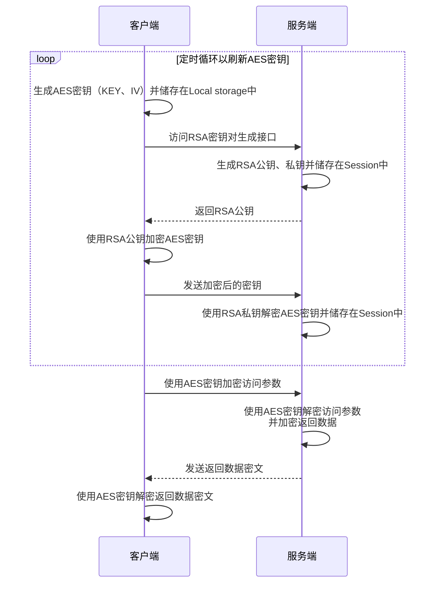

# SSK-xadmin
## 本系统加密通信时序如图：


## 本系统涉及的第三方模块及版本有：
```
X-admin v2.2
LayUI v2.9.9
ezSQL v2.17
Font Awesome Free v6.4.2
crypto-js v4.1.1
Google Authenticator 2-factor authentication @author Michael Kliewe
```

## 想说的话

* 本系统为自用的 X-admin php二开版，目前系统内已经包含的功能有：加密通信、菜单管理、用户组管理、用户管理、密码重置、OTP动态密码登录、绑定等，可跳过开发以上管理功能，直接进入开发业务功能阶段，图文介绍详见[说明书.pdf](说明书.pdf)。

* 本系统可实现前后端加密通信【具体加密流程图、数据加密状态等详见[说明书.pdf](说明书.pdf)】，启用加密通信后，后端生成RSA公钥私钥，前端生成AES秘钥并获取后端生成的公钥，并用公钥加密AES秘钥传回后端，前后端再通过AES秘钥加密通信数据进行通信，并可定时（秒级）刷新AES秘钥，在确保客户端安全的前提下，个人认为通信数据应该是安全的，如果在客户端通过分析js获取秘钥再解密的情况，视为非安全客户端，就不在此范围内了

* 未使用thinkphp之类的php框架，因为本人不会。。。
本人为十多年的跨界初学者，大学学的电子信息，上大学开始折腾Discuz、WordPress，现在工作好多年了，为了折腾，用一点才学一点，所以很多地方需要大家指正，在我改正之前将就用吧

* 由于未使用各种框架，所以大家的第三次开发门槛也很低，会点前后端就能做自己的系统了

* 系统说明、运行环境、使用方法、加密流程等详见【[说明书.pdf](说明书.pdf)】，已申请软著，说明书对应v1.0.0代码，目前代码已更新，略有不同，代码中也有具体注释，不懂的地方可以进群共同探讨<a target="_blank" href="https://qm.qq.com/cgi-bin/qm/qr?k=UsnJVf1m5AvRewYrlrvSYBWny5BFqFXF&jump_from=webapi&authKey=0GP4QQ1exvkbxPTsTWVtlgsQbEpYp163tlV9K4ktjn/wjGxuGYZvfvqu/To0fXvL"></a>

* 本系统用户管理功能中有组和扩展组，该设计借鉴了Discuz，其他地方也借鉴了一些，可以说Discuz也算是我的启蒙老师了，当年加入了一个小小的灵异论坛管理团队，为了实现一些功能各种学习各种查，慢慢就这么用上了

* 由于本人比较喜欢折腾，在工作中开发了很多单页工具，慢慢越来越多，为了方便管理开始查找类似项目，但都不合我意，不是太难我没法下手，就是功能、UI太复杂，只想找个简简单单的，但是没找到，于是萌生了自己制作的想法

* 本项目从2023年4月12日立项，到2024年11月19日完成 v1.0.0 开始申请软著，再到2025年2月17日成功下证，再然后又继续敲敲打打到今天（26日），每次有了新想法就开个issue，断断续续的开发了近两年时间，在自家NAS上的gitlab中积累了近150次提交，磨磨蹭蹭的慢慢搞到现在这个差不多能拿得出手的状态，由于本人才疏学浅，必然存在各种各样的问题，欢迎大家来群里共同探讨<a target="_blank" href="https://qm.qq.com/cgi-bin/qm/qr?k=UsnJVf1m5AvRewYrlrvSYBWny5BFqFXF&jump_from=webapi&authKey=0GP4QQ1exvkbxPTsTWVtlgsQbEpYp163tlV9K4ktjn/wjGxuGYZvfvqu/To0fXvL"></a>

* **这是本人公开的第一个大型项目（PS：对于本人来说的大型项目），如果本项目对您有帮助，麻烦右上角点一下小星星鼓励我一下下~~**
